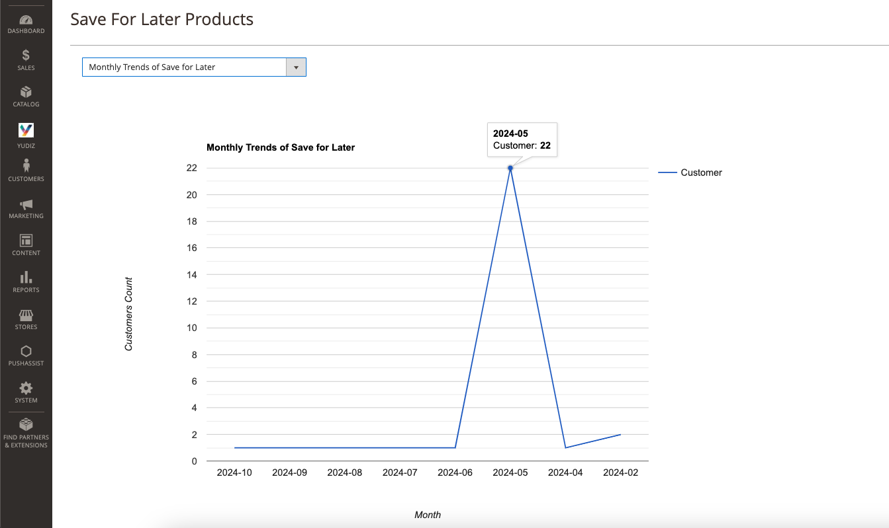

# Save For Later Extension for Magento 2

The "Save For Later" extension for Magento 2 makes shopping easier. It lets logged-in customers save products they like but aren't ready to buy yet, similar to what you see on Amazon. This way, shoppers can keep track of what they're interested in without having to make a purchase right away.

By adding this feature to your store, you're giving customers more flexibility and making it easier for them to shop at their own pace. Admins can enable or disable the module And also can view which products customers have saved, along with the quantity of each item. Furthermore, they can analyze this data through intuitive graphs, such as daily activity metrics, popular product trends, monthly insights, and yearly overviews.

The "Save for Later" module helps admins understand what customers like, so they can make the website better for everyone. This means happier customers and smarter marketing.

## Features

- Easy to use
- User-friendly interface
- Users can effortlessly save products for later
- Admins can easily configure the module

## Installation

You can install the Yudiz Save For Later Extension using one of two methods:
 1. Via Composer 
 2. By downloading it directly from the available source.
 
### 1. Install via composer

Before installing the Yudiz Save For Later Extension, it is necessary to install the Yudiz Core module. You can obtain the Yudiz Core module by using the following code.

Run the following command:
```shell
composer require yudiz/module-core
```
Now, To install the Yudiz Save For Later Extension via Composer, follow these steps in  your Magento 2 root folder:

Run the following command:
```shell
composer require yudiz/saveforlater
```
After a successful installation, execute the following commands:

```shell
php bin/magento setup:upgrade
php bin/magento setup:static-content:deploy -f
php bin/magento c:c
```

With these steps completed, you'll be ready to utilize the Yudiz Save For Later Extension.

### 2. Download Directly

Before Downloading the Yudiz Save For Later Extension, it is necessary to have the Yudiz Core module. You can download the module directly from below link:

https://github.com/yudiz-solutions/yudiz-core

Once the zip file is downloaded, extract its contents within the 'app/code/Yudiz/Core' directory.

Now, To install the Yudiz Save For Later Extension you can download the Extension from below link:

https://github.com/yudiz-solutions/magento-save-for-later

After successfully downloading the module, follow these steps to install it:

1.Unzip the downloaded folder.

2.Place the unzipped extension folder into the following path:

```shell
project-root-directory/app/code/Yudiz/SaveForLater
```

Indeed, after placing the extension folder in the specified directory, follow these Magento commands to complete the installation:
```shell
php bin/magento setup:upgrade
php bin/magento setup:static-content:deploy -f
php bin/magento c:c
```

By following these 2 Ways you can easily obtain and install the module. For detailed instructions on its usage, refer to the user guide within this document.

## Magento 2 Save For Later User Guide

Login to the **Magento Admin**, navigate to `Yudiz -> Save For Later Configuration `.

There,You can find two options: configuration, and Save for later Products and Analyzation.

<div>
    
</div><br/>

#### 1. General Configuration 

- Extension enable : Select Yes/No to enable or disable the module

<div>
    
</div><br/>

Click on "Save", which will save the configuration.

#### 2. Save for later Products and Analyzation 

Here, you can find the option to select different charts to analyze the 'save for later' section for marketing purposes. You can analyze this data through intuitive graphs, such as daily activity metrics, popular product trends, monthly insights, and yearly overviews.

By using these graphs, you can analyze the data in various ways on a daily, monthly, and yearly basis.

Once you choose the graph type, the graph will appear, as shown in the image below.
<div>
    
</div><br/>

Furthermore, inside this page, as you scroll down, you'll be able to access a grid for detailed data analysis. Within this section, you can thoroughly examine and interpret the data of the 'save for later' section. This feature proves beneficial for marketing purposes as well, offering valuable insights into consumer behavior and preferences.

<div>
    
</div><br/>


## Frontend 

After a customer adds a product to the cart within the mini-cart, they can see a single button labeled "Save for Later".
Only logged-in customers can use the "Save for Later" option to add products.

<div>
    
</div><br/>

Upon clicking this button, all products in the cart will be moved to the "Save for Later" section. 

To access this section, customers can navigate to "My Account" and find the "Save for Later" tab. Here, they can view all the products they have moved for later consideration.

<div>
    
</div><br/>


As you can see in the above screenshot, customers can easily manage products from the "Save for Later" section. They can add products back to the cart, adjust the quantity, and remove items.However, if a product is out of stock or the desired quantity isn't available, it won't be added to the cart.

 Additionally, if there are more than 5 or 6 products in the "Save for Later" section, a loader will appear for seamless navigation.

<div>
    
</div><br/>

Following the actions described, customers will receive messages similar to those shown in the screenshots. Whether they add, remove, or encounter any issues, appropriate messages will be displayed for clarity and guidance.


